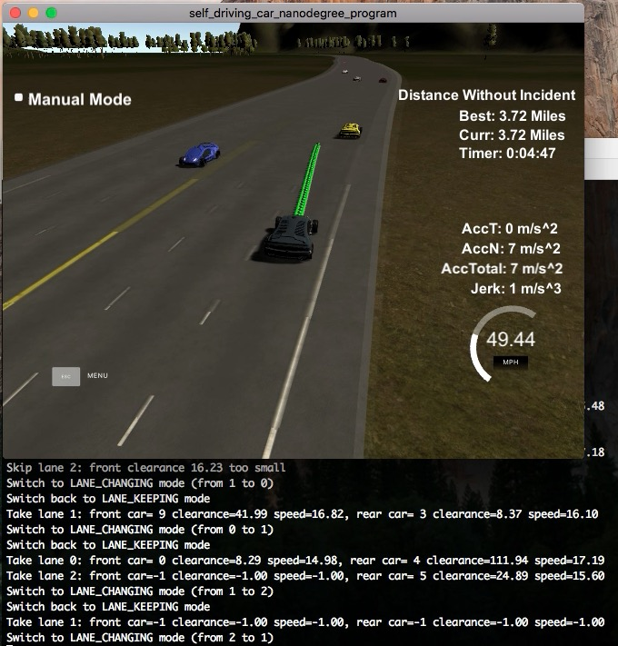

## Path-Planning Project

Yangchun Luo<br>
July 21, 2018

This is the assignment for Udacity's Self-Driving Car Term 3 Project 1.

---

The goal of this project is to safely navigate around a virtual highway with other traffic that is driving +-10 MPH of the 50 MPH speed limit. The simulator will provide the car's localization and sensor fusion data. There is also a sparse map list of waypoints around the highway.

* The car should try to go as close as possible to the 50 MPH speed limit, which means passing slower traffic when possible, note that other cars will try to change lanes too.
* The car should avoid hitting other cars at all cost as well as driving inside of the marked road lanes at all times, unless going from one lane to another.
* The car should be able to make one complete loop around the 6946m highway. Since the car is trying to go 50 MPH, it should take a little over 5 minutes to complete 1 loop. 
* The car should not experience total acceleration over 10 m/s^2 and jerk that is greater than 10 m/s^3.

### To build

```bash
mkdir build
cd build
cmake ..
make
```

### To run

Download the [Term 3 Simulator](https://github.com/udacity/self-driving-car-sim/releases/tag/T3_v1.2).

Other setup information can be found in the original [README](README-orig.md) file.

To run the path planner:

```bash
./path_planning
```


### Code Organization

The source code of this project is organized in the following way:

- `main.cpp`: the entry point and the web socket connection boilerplate code to the simulator.
- `common_utils.h`: commonly used utility functions marked as `inline`.
- `env_context.h`: the wrapper class `EnvContext` includes the constant environment values (e.g. lane width, number of lanes, simulator update frequency, etc) and the data passed from simulator.
- `highway_map.cpp/h`: contains the class `HighwayMap` which encapsulates the methods to load the map, convert x, y Cartesian coordinates to/from s, d Frenet coordinates, and retrieves the waypoints.
- `planner.cpp/h`: the path planner logic.   

### Reflection on Path Generation

The path generation is broken into the following four steps (in `src/planner.cpp`):

```cpp
/**
 * Public interface of the path planner.
 * @param context
 * @return trajectory in x, y global coordinates.
 */
vector<vector<double>> Planner::planPath(const EnvContext &context) {
    // 1. Build information about each lane.
    const vector<LaneInfo> lane_infos = buildLaneInfos(context);

    // 2. Determine target lane and velocity.
    auto target_speed = planMotion(context, lane_infos);

    // 3. Update current speed.
    updateVelocity(context, target_speed);

    // 4. Generate trajectory.
    return generateTrajectory(context);

}
```

#### 1. Build lane information

In the first step, information is gathered for each lane according to the data passed from simulator. For each lane, I calculated the speed, clearance in front and rear direction (simply based on the closest car in the lane direction). If no car is detected in that direction, the speed and clearance is considered infinity.

#### 2. Determine target land and velocity

There are two states in finite-state machine (FSM): `LANE-KEEPING` and `LANE-CHANGING`.

The FSM starts with `LANE-KEEPING`. In this state, I first check if the current lane's front clearance is above the safety margin of 30 meters. If so, set the target speed to speed limit (49 mph). Otherwise, I check if the front clearance is critically low (5 and 10 meters, in case other cars suddenly cut into my lane) and reduce the speed to lower than the lane's front speed to increase the clearance. Otherwise, I make a decision whether to do a lane change (to be discussed shortly) and if so, set the FSM states to `LANE-CHANGING`. Otherwise, the target speed is set to the lane front speed.

In the `LANE-CHANING` state, I check if the target lane's front clearance is above the safety margin of 30 meters. If so, set the target speed to speed limit. Otherwise, set the target speed to lane front speed. When the current latitudinal value is within 0.2 meters of the lane center, lane changing is done and the FSM states changes back to `LANE-KEEPING`. 

As a possible improvement, I could check for collision during lane change and abort it if necessary. But since I left enough margin when deciding to do a lane change in the first place, the lane change can be completed safely assuming other cars do not make crazy moves.

#### 2.1 Decide for lane change

There can be up to two candidate lanes. For each candidate, it is checked for safety: front clearance > 30 meters and rear clearance > 5 meters. Also, if clearance is less than 15 meters and the rear car is approaching at a high relative speed, it is considered unsafe. In addition, if the candidate's clearance < 45 and the front speed < current lane's front speed, there is really no point to switch to this slower lane.

When there are multiple candidate lanes, the top one based on its front clearance and then rear clearance is chosen.

The above policy is simple and easily verifiable. It optimizes for speed: when the clearance at the current lane is low, we look for an opportunity to safely switch to a faster lane (either is speed is higher or clearance is higher so we can accelerate to speed limit). This behavior is evidenced in the [project recording](./path-planning-recording.mp4) as well.

#### 3. Update current speed

The above outputs target lane and velocity. Based on the target velocity, I increment or decrement the current velocity within the acceleration limit (10 m/s^2) so that we won't exceed max jerk. And if the current velocity is within the range of a single update, it is directly set to the target velocity (assuming a well-turned PID controller).

#### 4. Generate trajectory

Trajectory generation is essentially following the project walk-through using the previous path points and a spline smoother. In each update cycle, three evenly spaced points (30 meters apart) on the target lane are added to the spline for smoothing. 50 points of 30 meters horizon are used to generate the path points sent back to the simulator.

### Project Recording

The project recording of running one entire loop can be [here](./path-planning-recording.mp4). The car finished the loop without any incident in 5 minutes. Most of the time, it sticks with the 50 MPH speed limit by switching lanes as the opportunity window opens.

